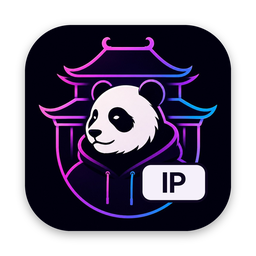
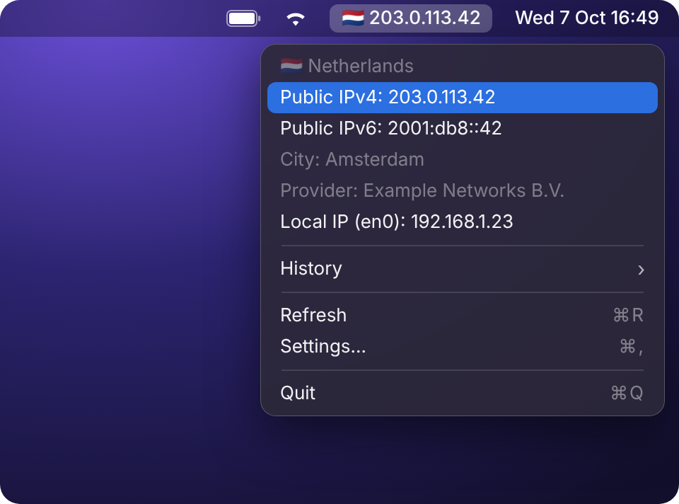
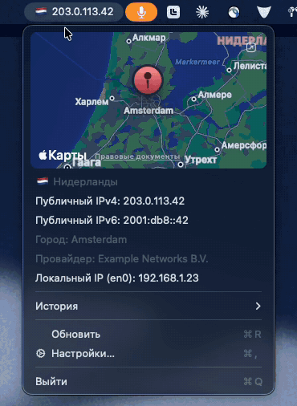
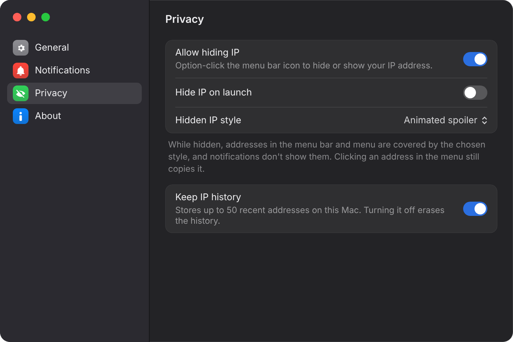

<p align="center">
  
</p>

<h1 align="center">Show My IP</h1>

<p align="center">Your country flag and public IP in the macOS menu bar.</p>

<p align="center">
  
  
  
  
</p>

<p align="center"><a href="README.ru.md">Русская версия</a></p>

<p align="center"></p>

## Features

- **Flag and IP in the menu bar,** with a compact mode for small screens.
- **Auto-refresh** of the IP and flag.
- **Details on click.** Country, public IPv4 and IPv6, local addresses, and optionally city and provider. Click an address to copy it.
- **VPN status** in the menu, optional 🔒 in the menu bar, and an alert when the VPN disconnects.
- **Map** of the IP location in the menu (optional).
- **History** of recent IP changes, kept only on your Mac.
- **Privacy mode.** ⌥-click the icon to hide the IP behind a spoiler — handy on calls and in cafés.
- **Notifications.** Country change, IP change, connection loss, a warning when traffic leaves through your home country — VPN may be off, and a warning when IPv6 goes through another country than IPv4 — IPv6 may bypass the VPN.
- **Launch at login.**
- **English and Russian** interface.
- **Private by design.** No analytics, no third-party dependencies, sandboxed.

<p align="center"></p>
<p align="center"></p>

## Installation

1. Download [ShowMyIP.dmg](https://github.com/pandamy619/show-my-ip/releases/latest/download/ShowMyIP.dmg) from the latest [release](https://github.com/pandamy619/show-my-ip/releases).
2. Drag **Show My IP** to **Applications**.
3. Launch it. The app is not signed by Apple, so macOS blocks the first launch: open **System Settings → Privacy & Security** and click **Open Anyway**. This is needed once.

## Usage

- Click the flag to see details and copy addresses.
- ⌥-click the flag to hide or show the IP (turn it on in Settings → Privacy).
- **Settings** (⌘,):
  - **General** — launch at login, display mode (Automatic / Compact / Full), compact style, IPv4 or IPv6 in the menu bar, city and provider, map.
  - **Notifications** — what to notify about and your home country.
  - **Privacy** — IP hiding, hidden IP style, IP history.
- **Home country alert:** turn off your VPN, open Settings → Notifications and pick the country you are in. You will be warned whenever your traffic goes out through it.

<p align="center"></p>
<p align="center"></p>

## FAQ

**Only a flag, no IP.**
That is the compact mode. Change it in Settings → General.

**No Dock icon.**
By design — the app lives in the menu bar. Quit from its menu (⌘Q).

**How do I uninstall?**
Quit the app and move it from Applications to the Trash.

## Privacy

The app makes only these HTTPS requests:

| Service | When | Data received |
|---|---|---|
| `1.1.1.1/cdn-cgi/trace` | every refresh | IPv4, country |
| `[2606:4700:4700::1111]/cdn-cgi/trace` | every refresh, if your Mac has IPv6 | IPv6 |
| `www.cloudflare.com/cdn-cgi/trace` | only if the request above fails | IP, country |
| `ipinfo.io/json` | only if Cloudflare fails | IP, country, city, provider |
| `ipinfo.io/<your IP>/json` | only with “Show city and provider” on, once per new IP | city, provider, coordinates |
| Apple Maps | only with “Show map” on | map tiles around the IP location |

IP history is stored only on your Mac.

Responses are validated before use. The IP is logged as private and never appears in system logs in plain text. The app runs in the App Sandbox with Hardened Runtime and only the outgoing network entitlement.

## For developers

Requirements: Xcode 26+, macOS 14+.

```sh
git clone https://github.com/pandamy619/show-my-ip.git
cd show-my-ip
open ShowMyIP.xcodeproj
```

| Command | Description |
|---|---|
| `make test` | unit tests (Swift Testing) |
| `make lint` | SwiftLint + swift-format, strict |
| `make format` | auto-format |
| `make hooks` | run lint before every commit |
| `make release` | build `build/ShowMyIP.dmg` |

`make lint` needs SwiftLint: `brew install swiftlint`.

```
ShowMyIP/
  App/            app state, refresh logic, logging
  Domain/         validated models: IP address, country code, IP info
  Services/       HTTP client, IP providers, network monitor
  Notifications/  notification rules and delivery
  Privacy/        IP hiding and spoiler effect
  History/        IP change history
  Settings/       settings window, launch at login
  UI/             menu bar label, menu, display modes
ShowMyIPTests/    tests mirroring the app structure
```

Country areas for the map come from [Natural Earth](https://www.naturalearthdata.com) (public domain).

The app icon is generated from `design/logo.jpg` with `scripts/make_app_icon.py`.

## License

[MIT](LICENSE)
