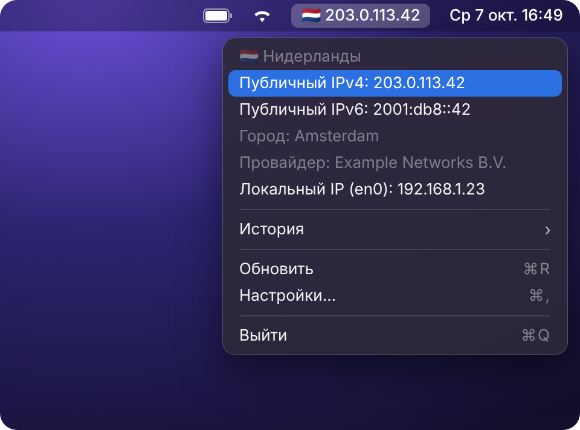
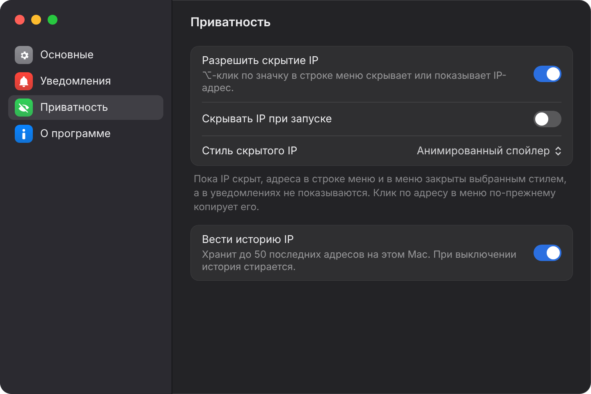

<p align="center">
  
</p>

<h1 align="center">Show My IP</h1>

<p align="center">Флаг страны и внешний IP в меню-баре macOS.</p>

<p align="center">
  
  
  
  
</p>

<p align="center"><a href="README.md">English version</a></p>

<p align="center"></p>

## Возможности

- **Флаг и IP в меню-баре,** с компактным режимом для небольших экранов.
- **Автообновление** IP и флага.
- **Детали по клику.** Страна, публичные IPv4 и IPv6, локальные адреса и, по желанию, город и провайдер. Клик по адресу копирует его.
- **Статус VPN** в меню, 🔒 в меню-баре по желанию и уведомление, если VPN отключился.
- **Проверка утечки DNS** (по желанию): в какой стране ваш DNS-сервер и предупреждение, если не там же, где IP.
- **Карта** местоположения IP в меню (по желанию).
- **История** последних смен IP, хранится только на вашем Mac.
- **Режим приватности.** ⌥-клик по значку прячет IP под спойлер — удобно на созвонах и в кафе.
- **Уведомления.** Смена страны, смена IP, потеря сети, предупреждение, если трафик пошёл через домашнюю страну — возможно, VPN выключен, и предупреждение, если IPv6 идёт через другую страну, чем IPv4 — возможно, IPv6 идёт мимо VPN.
- **Автозапуск** при входе в систему.
- **Русский и английский** интерфейс.
- **Приватность.** Без аналитики и сторонних зависимостей, в песочнице.

<p align="center"></p>
<p align="center"></p>

## Установка

1. Скачайте [ShowMyIP.dmg](https://github.com/pandamy619/show-my-ip/releases/latest/download/ShowMyIP.dmg) из последнего [релиза](https://github.com/pandamy619/show-my-ip/releases).
2. Перетащите **Show My IP** в **Программы**.
3. Запустите. Приложение не подписано Apple, поэтому macOS заблокирует первый запуск: откройте **Системные настройки → Конфиденциальность и безопасность** и нажмите **Всё равно открыть**. Это нужно сделать один раз.

## Использование

- Клик по флагу — детали и копирование адресов.
- ⌥-клик по флагу — скрыть или показать IP (включается в Настройки → Приватность).
- **Настройки** (⌘,):
  - **Основные** — автозапуск, режим отображения (Автоматически / Компактно / Полностью), компактный вид, IPv4 или IPv6 в меню-баре, город и провайдер, карта.
  - **Уведомления** — о чём уведомлять и домашняя страна.
  - **Приватность** — скрытие IP, стиль скрытия, история IP.
- **Предупреждение о домашней стране:** выключите VPN, откройте Настройки → Уведомления и выберите страну, в которой находитесь. Приложение предупредит, когда трафик пойдёт через неё.

<p align="center"></p>
<p align="center"></p>

## FAQ

**Виден только флаг, без IP.**
Это компактный режим. Меняется в Настройки → Основные.

**Нет иконки в Dock.**
Так задумано: приложение живёт в меню-баре. Выйти — через его меню (⌘Q).

**Как удалить?**
Закройте приложение и перенесите его из Программ в Корзину.

## Приватность

Приложение делает только эти HTTPS-запросы:

| Сервис | Когда | Что получаем |
|---|---|---|
| `1.1.1.1/cdn-cgi/trace` | при каждом обновлении | IPv4, страна |
| `[2606:4700:4700::1111]/cdn-cgi/trace` | при каждом обновлении, если на Mac есть IPv6 | IPv6 |
| `www.cloudflare.com/cdn-cgi/trace` | только если запрос выше не прошёл | IP, страна |
| `ipinfo.io/json` | только если Cloudflare не ответил | IP, страна, город, провайдер |
| `ipinfo.io/<ваш IP>/json` | только с включённым «Показывать город и провайдера», один раз на новый IP | город, провайдер, координаты |
| `whoami.akamai.net` (DNS-запрос) | только с включённым «Проверять DNS-сервер» | IP вашего DNS-сервера |
| `ipinfo.io/<IP DNS-сервера>/json` | только с включённым «Проверять DNS-сервер», один раз на новый сервер | страна и провайдер DNS-сервера |
| Apple Maps | только с включённым «Показывать карту» | фрагменты карты вокруг местоположения IP |

История IP хранится только на вашем Mac.

Ответы проверяются перед использованием. IP пишется в лог как приватный и не виден в системных логах открытым текстом. Приложение работает в App Sandbox с Hardened Runtime, из прав — только исходящие соединения.

## Для разработчиков

Требования: Xcode 26+, macOS 14+.

```sh
git clone https://github.com/pandamy619/show-my-ip.git
cd show-my-ip
open ShowMyIP.xcodeproj
```

| Команда | Что делает |
|---|---|
| `make test` | юнит-тесты (Swift Testing) |
| `make lint` | SwiftLint + swift-format, строгий режим |
| `make format` | автоформатирование |
| `make hooks` | линтер перед каждым коммитом |
| `make release` | собрать `build/ShowMyIP.dmg` |

Для `make lint` нужен SwiftLint: `brew install swiftlint`.

```
ShowMyIP/
  App/            состояние приложения, обновление IP, логирование
  Domain/         проверяемые модели: IP-адрес, код страны, данные об IP
  Services/       HTTP-клиент, провайдеры IP, монитор сети
  Notifications/  правила и доставка уведомлений
  Privacy/        скрытие IP и эффект спойлера
  History/        история смен IP
  Settings/       окно настроек, автозапуск
  UI/             значок в меню-баре, меню, режимы отображения
ShowMyIPTests/    тесты по той же структуре
```

Границы стран для карты взяты из [Natural Earth](https://www.naturalearthdata.com) (общественное достояние).

Иконка собирается из `design/logo.jpg` скриптом `scripts/make_app_icon.py`.

## Лицензия

[MIT](LICENSE)
